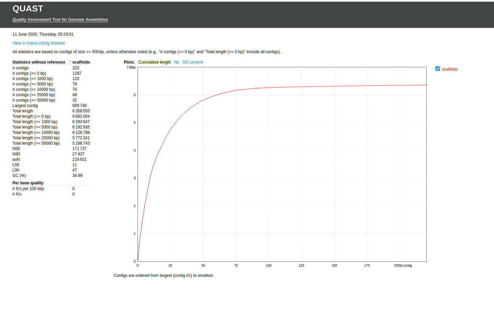

# Bacterial Genome Assembly and Annotation Using SPAdes and QUAST

## Project Overview

This project demonstrates the assembly and quality assessment of a bacterial genome using next-generation sequencing (NGS) data. The workflow was completed as part of coursework in the Master of Science in Biotechnology (Bioinformatics Concentration) program at the University of Maryland Global Campus (UMGC).

### Organism

Bacillus thuringiensis

## Objectives

* Perform de novo genome assembly using SPAdes
* Evaluate assembly quality using QUAST
* Analyze scaffold statistics and assembly metrics
* Interpret assembly quality indicators such as N50 and genome completeness

## Tools Used

| Tool   | Purpose                     |
| ------ | --------------------------- |
| SPAdes | Genome Assembly             |
| QUAST  | Assembly Quality Assessment |
| Linux  | Data Processing             |
| Bash   | Workflow Execution          |

## Workflow

### Step 1: Quality Assessment

Raw sequencing reads were evaluated prior to assembly.

### Step 2: Genome Assembly

Genome assembly was performed using SPAdes with multiple k-mer values.

Example command:

```bash
spades.py -k 21,33,55,77,99,127 \
--pe1-1 reads_R1.fastq.gz \
--pe1-2 reads_R2.fastq.gz \
-o assembly
```

### Step 3: Assembly Evaluation

Assembly quality was assessed using QUAST.

Example command:

```bash
quast.py scaffolds.fasta -o quast_results
```
## QUAST Assembly Report



## Repository Structure

├── README.md
├── quast_report.png
├── assembly/
└── quast_results/

## Results

### Assembly Metrics

| Metric | Value |
|----------|---------|
| Number of Scaffolds | 220 |
| Largest Scaffold | 589,740 bp |
| Total Assembly Length | 6,358,555 bp |
| N50 | 171,737 bp |
| N90 | 27,437 bp |
| GC Content | 34.99% |
| L50 | 11 |
| L90 | 47 |
| BUSCO Completeness | 85% |
| Number of Ns | 0 |

## Key Findings

- The final assembly consisted of 220 scaffolds with a total assembled genome size of approximately 6.36 Mb.
- The largest scaffold was 589,740 bp.
- The assembly achieved an N50 of 171,737 bp, indicating moderate assembly contiguity.
- The GC content was 34.99%, consistent with the expected range for Bacillus thuringiensis.
- No ambiguous bases (Ns) were detected in the final assembly.
- Assembly fragmentation likely reflects repetitive genomic regions and limitations associated with short-read sequencing data.
  
## Skills Demonstrated

* Genome Assembly
* Bioinformatics Workflow Development
* Linux Command Line
* Bash Scripting
* Sequence Data Analysis
* Quality Assessment of Genome Assemblies

## Discussion

The assembly statistics indicate a reasonably complete bacterial genome assembly. The assembled genome size (6.36 Mb) and GC content (34.99%) are consistent with published Bacillus thuringiensis genomes. Although the assembly contains multiple scaffolds, the N50 value of 171,737 bp and the presence of several large scaffolds suggest that substantial portions of the genome were successfully reconstructed. BUSCO analysis indicated approximately 85% genome completeness, supporting the overall quality of the assembly while also suggesting that some genomic regions may remain incomplete or fragmented. Additional long-read sequencing technologies, such as Oxford Nanopore or PacBio sequencing, could further improve assembly contiguity and reduce fragmentation.

## Author

Ayorinde Ojo

Graduate student in Biotechnology (Bioinformatics Concentration)

University of Maryland Global Campus
